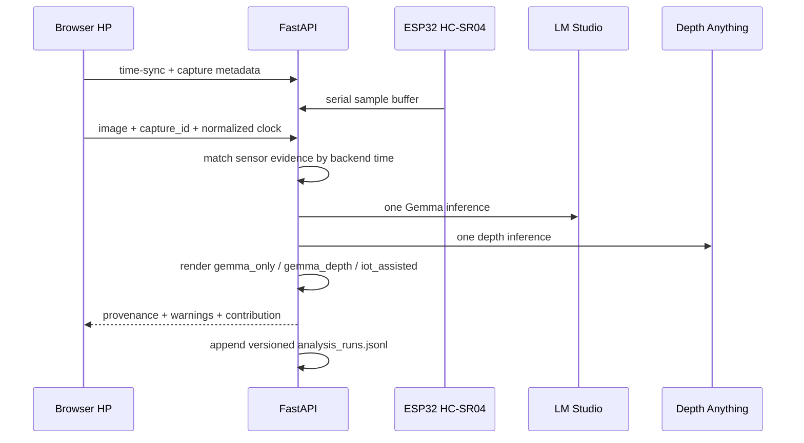

# Arsitektur runtime IoT-assisted

Sensor evidence adalah channel terpisah dari semantik Gemma. Dua sensor yang konflik tidak dirata-ratakan. Mode IoT hanya menambah referensi frontal pada capture kamera environment yang fresh; sistem tidak mengikat sensor ke objek bernama dan tidak menghasilkan navigasi aman.

Record runtime kanonik berada di `results/analysis_runs.jsonl`. `results/predictions.csv` adalah export kompatibilitas evaluator, bukan sumber kebenaran.
