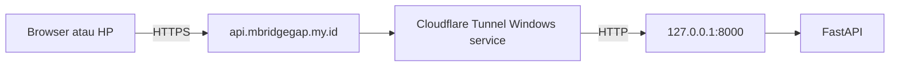
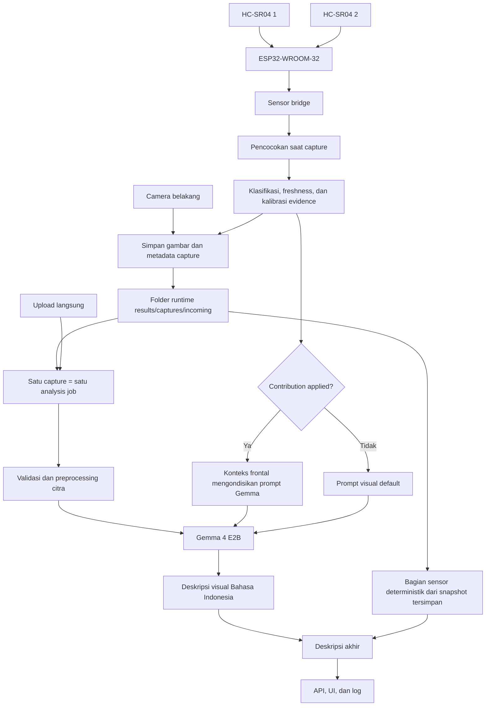

# Arsitektur Bridge-Gap

## Topologi runtime



Cloudflare menangani HTTPS publik. Origin FastAPI tetap HTTP dan bind ke `127.0.0.1:8000`.

## Provenance analisis

Setiap `analysis_run` menyimpan provenance Gemma per run: versi aplikasi, provider, model ID, prompt penuh, hash SHA-256 prompt, temperature, batas token, waktu mulai request, status mock, dan raw response provider. Provenance ini tidak boleh diturunkan kembali dari source atau konfigurasi ketika artefak evaluasi dibekukan.

## Alur sistem



Referensi sensor terverifikasi dapat memengaruhi keluaran melalui prompt
sensor-conditioned, tetapi tidak menjadi identitas objek atau ground truth visual.
Gemma tidak menghitung angka jarak. Backend tetap menjadi sumber perhitungan
referensi frontal dan menambahkan bagian sensor deterministik dengan provenance
terpisah.

## Urutan proses

1. Klien membuat `capture_id` dan timestamp capture; backend menetapkan batch runtime.
2. `POST /captures` memvalidasi citra, mencocokkan sensor pada waktu capture, lalu menyimpan gambar dan metadata secara lokal tanpa menjalankan Gemma.
3. UI memperbarui jumlah capture tersimpan.
4. Backend memilih satu capture dan membuat satu job melalui `POST /captures/{capture_id}/analysis-jobs`.
5. Job membaca citra dan sensor evidence yang sudah tersimpan; sensor tidak dicocokkan ulang.
6. Backend memeriksa status evidence tersimpan dan, bila seluruh gate terpenuhi,
   menerapkan koreksi sesuai profil pada setiap sensor.
7. Backend menghitung referensi frontal; hanya contribution `applied` yang membentuk
   konteks prompt sensor-conditioned.
8. Gemma menghasilkan deskripsi dari citra RGB dan prompt yang sesuai mode.
9. Backend menambahkan bagian referensi sensor deterministik tanpa menyebut objek
   tertentu dan menyimpan provenance kedua segmen.
10. Status capture berubah `captured → queued → running → completed/failed`.
11. Runner backend menunggu satu job selesai sebelum mengirim capture berikutnya.

Jika backend restart ketika record masih `queued` atau `running`, endpoint mendeteksi bahwa job in-memory sebelumnya sudah tidak ada, menandai percobaan tersebut `failed`, lalu mengizinkan retry sebagai job baru. Gambar dan sensor evidence asli tetap digunakan.

## Prinsip ToF dan data sensor

HC-SR04 menghitung jarak dari waktu echo pulang-pergi:

```text
d = v * t / 2
```

Firmware mengirim jarak dalam sentimeter. Backend tidak mengestimasi jarak dari citra. Untuk base case paired:

```text
pair_disagreement_cm = abs(sensor_1_cm - sensor_2_cm)
sensor_1_corrected_cm = intercept_1 + slope_1 * sensor_1_cm
sensor_2_corrected_cm = intercept_2 + slope_2 * sensor_2_cm
frontal_reference_cm = (sensor_1_corrected_cm + sensor_2_corrected_cm) / 2
```

Rata-rata hanya valid sebagai ringkasan aplikasi jika:

- kedua sampel valid;
- kedua sampel segar;
- arah kamera `environment` sesuai arah sensor;
- selisih pasangan tidak melewati ambang konfigurasi.
- profil kalibrasi 5 jarak x 30 pembacaan valid dan menyediakan model koreksi untuk kedua sensor.

Nilai sensor individual, timestamp, age, dan status tidak boleh dibuang setelah rata-rata dibuat.

## State evidence

| Status | Makna | Kontribusi ke deskripsi |
|---|---|---|
| `paired` | dua sampel lolos seluruh gate | rata-rata sebagai referensi frontal |
| `partial` | hanya satu sampel dapat dipakai | nilai individual dapat tampil di detail; tanpa rata-rata pasangan |
| `pair_conflict` | disagreement melewati ambang | ditahan; status konflik |
| `stale` | sampel terlalu tua | ditahan; status stale |
| `direction_mismatch` | arah kamera tidak sesuai sensor | ditahan; status mismatch |
| `unavailable` | bridge/sampel tidak tersedia | ditahan; status unavailable |

## Kontrak request

`POST /captures` menerima multipart form berisi citra, `capture_id`,
`capture_time_ms`, `camera_facing_mode`, metadata clock, dan `ground_truth_cm`.
Backend menetapkan batch `capture-candidates` dan menyimpan hasil pada:

```text
results/captures/incoming/images/capture_candidates/<capture_id>.<ext>
results/captures/incoming/records/<capture_id>.json
```

`results/captures/images/dataset_v2_clean/`, record final yang dirujuk manifest,
dan seluruh artefak evaluasi v2 berada di luar repository runtime tersebut. Endpoint
capture tidak dapat menambah atau menimpa paket evaluasi yang sudah dibekukan.

`POST /captures/{capture_id}/analysis-jobs` tidak menerima ulang gambar atau sensor. Endpoint membaca snapshot tersimpan dan membuat satu job independen.

`POST /analyze` menerima multipart form:

- `image`;
- `capture_id`;
- `capture_time_ms`;
- `camera_facing_mode`;
- `clock_offset_ms` dan `clock_rtt_ms` bila sinkronisasi clock tersedia;
- `save_result`.

Input tanpa metadata capture masih dapat menghasilkan deskripsi visual, tetapi evidence sensor tidak dipaksakan.

## Kontrak response

Contoh konseptual:

```json
{
  "success": true,
  "analysis_run_id": "run_001",
  "gemma_description": "Di dalam ruangan terlihat meja dan dua kursi.",
  "final_description": "Di dalam ruangan terlihat meja dan dua kursi. Referensi sensor frontal sekitar 63.5 cm pada arah sensor.",
  "sensor_evidence": {
    "capture_id": "cap_001",
    "status": "paired",
    "pair_disagreement_cm": 1.2,
    "samples": {
      "sensor_1": {"distance_cm": 60.1, "age_ms": 35, "status": "ok"},
      "sensor_2": {"distance_cm": 61.3, "age_ms": 41, "status": "ok"}
    }
  },
  "sensor_contribution": {
    "status": "applied",
    "sensor_1_cm": 60.1,
    "sensor_2_cm": 61.3,
    "sensor_1_corrected_cm": 62.8,
    "sensor_2_corrected_cm": 64.1,
    "frontal_reference_cm": 63.45,
    "description": "Referensi sensor frontal sekitar 63.5 cm pada arah sensor.",
    "warnings": []
  },
  "latency": {}
}
```

Nama field aktual harus dijaga oleh schema dan regression test. Contoh ini menjelaskan semantik, bukan bukti nilai pengujian.

## Penanganan kondisi tidak lengkap

- Gemma gagal: return error; jangan membuat deskripsi pengganti seolah berasal dari model.
- Sensor unavailable: deskripsi visual tetap dapat selesai dengan status sensor eksplisit.
- Partial: simpan nilai sensor yang ada; jangan membuat rata-rata dua sensor.
- Pair conflict: simpan kedua nilai dan disagreement; jangan merata-ratakan.
- Stale: simpan alasan; jangan memasukkan angka ke deskripsi akhir.
- Direction mismatch: jangan menerapkan evidence sensor pada frame kamera depan.
- Timestamp tidak dapat dipercaya: gunakan fallback yang terdokumentasi atau tandai evidence tidak cukup.

## Logging dan audit

Setiap run yang disimpan harus dapat menghubungkan:

- `analysis_run_id` dan `capture_id`;
- nama/identitas citra;
- prompt serta respons Gemma;
- sensor 1 dan sensor 2;
- received time, age, match time, dan sumber waktu;
- disagreement, status, reason code, dan kontribusi akhir;
- latency serta error.

Log runtime bukan ground truth. `ground_truth_cm` hanya berasal dari pengukuran eksternal pada protokol evaluasi.
