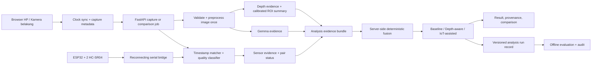

# Penyelesaian IoT-Assisted Image Analysis

**Branch:** `feat/complete-iot-assisted-analysis`
**Description:** Menyelesaikan kontrak data, pipeline backend, mode analisis, perbandingan, UI mobile, persistence, kalibrasi, dan evaluasi agar kamera, Gemma, Depth Anything, serta dua HC-SR04 bekerja dalam satu alur yang konsisten dan dapat diaudit.

## Goal

Menyediakan satu implementasi end-to-end yang membedakan dengan tegas Gemma Baseline, depth-aware, dan IoT-assisted pada frame yang sama. HC-SR04 dipakai sebagai referensi jarak frontal dan pendeteksi konflik, bukan sebagai depth-map, identitas objek, atau bukti navigasi aman.

Plan ini menganggap seluruh pekerjaan dikirim dalam satu PR, dengan setiap langkah di bawah menjadi satu commit yang dapat diuji secara mandiri.

## Progress

- [x] Step 1: Commit the Existing Sensor-Camera Foundation
- [x] Step 2: Introduce Typed Domain Contracts and Final Mode Taxonomy
- [x] Step 3: Normalize Phone Capture Time Against Backend Time
- [x] Step 4: Add Sensor Quality Classification and Calibration Profile
- [x] Step 5: Build a Shared Evidence Pipeline
- [x] Step 6: Implement Thesis-Safe IoT-Assisted Fusion
- [x] Step 7: Move Comparison to a Backend-Owned Job
- [x] Step 8: Unify Persistence and Audit Trail
- [ ] Step 9: Complete Mobile-LAN Runtime and Readiness Checks
- [ ] Step 10: Rebuild the UI Around Explicit System States
- [ ] Step 11: Extend Evaluation for IoT Contribution
- [ ] Step 12: End-to-End Acceptance and Documentation

## Current-State Findings

- Runtime aktif sudah membaca COM7, melakukan reconnect, memasangkan sampel menurut waktu capture, menampilkan dua sensor, dan mencatat `sensor_evidence`.
- Pipeline utama masih hanya mengenal `gemma_only`, `depth_only`, dan `gemma_depth`; `sensor_evidence` tidak diteruskan ke `services/pipeline.py` atau `models/fusion.py`.
- Tombol Bandingkan menjalankan Gemma-only dan depth-only secara berurutan, lalu membentuk late fusion di browser. Kolom ketiga bukan hasil aktual mode backend `gemma_depth` dan tidak menguji kontribusi IoT.
- Prediction dan sensor evidence disimpan terpisah sehingga belum ada satu record audit yang mengikat frame, sampel sensor, keluaran model, dan deskripsi akhir.
- Backend default masih bind ke `127.0.0.1`; akses kamera dari HP memerlukan binding LAN serta HTTPS yang dipercaya perangkat.
- Evaluator belum mempunyai mode, anotasi, atau metrik khusus pairing sensor, konflik sensor-depth, maupun kontribusi IoT.
- Working tree saat plan dibuat berisi implementasi sensor-camera yang belum menjadi commit serta artefak runtime `results/predictions.csv` dan `results/sensor_captures.jsonl`. Artefak runtime tidak boleh ikut ke commit fitur.

## Locked Design Decisions

1. Mode publik final:
   - `gemma_only`: baseline visual.
   - `depth_only`: diagnostik depth, bukan pembanding utama skripsi.
   - `gemma_depth`: Gemma + depth dengan late fusion berbatas bukti.
   - `iot_assisted`: Gemma + depth + referensi frontal HC-SR04.
2. Perbandingan utama memakai `gemma_only`, `gemma_depth`, dan `iot_assisted`. `depth_only` tetap tersedia pada detail teknis.
3. Sensor tidak boleh mengidentifikasi objek. Kalimat sensor selalu menyebut "referensi frontal" atau "bidang pandang sensor", bukan jarak objek yang disebut Gemma.
4. `iot_assisted` hanya valid untuk capture kamera `environment` dengan evidence segar. Upload biasa tetap memakai tiga mode non-IoT.
5. Dua sensor yang sepakat dapat diringkas sebagai referensi frontal. Dua sensor yang berbeda melewati ambang menjadi `pair_conflict` dan tidak boleh dirata-ratakan diam-diam.
6. Perbandingan dijalankan di backend memakai satu frame, satu snapshot sensor, satu inferensi Gemma, dan satu inferensi depth yang dipakai bersama.
7. Sistem tetap berupa prototype eksperimen: tidak ada klaim jarak objek presisi, navigasi aman, atau peningkatan kualitas sebelum evaluasi terkontrol selesai.

## Target Architecture

## Canonical Data Contract

Setiap capture menghasilkan satu `analysis_run_id` dan satu `capture_id`. Record kanonik minimal memuat:

- Capture: waktu klien, offset clock, RTT, waktu capture ternormalisasi, facing mode, ukuran frame, hash citra.
- Sensor: port, status koneksi, sampel terpilih per sensor, usia sampel, disagreement, status `paired | partial | pair_conflict | unavailable | direction_mismatch`.
- Calibration: versi profile, mapping bidang pandang sensor ke ROI depth, tanggal kalibrasi, status validasi.
- Gemma: model ID, structured output, description, latency, mock flag.
- Depth: model ID/path, summary grid, ROI sensor, category, latency, mock flag.
- Sensor contribution: `applied | conflict | insufficient | not_applicable`, referensi cm, consistency terhadap ROI depth, reason code.
- Output: mode, final description, provenance sections, warnings, latency total.
- Audit: schema version, app version/commit, timestamps, error fields.

## Implementation Steps

### Step 1: Commit the Existing Sensor-Camera Foundation

**Files:** `.env.example`, `.gitignore`, `README.md`, `app/config.py`, `app/main.py`, `app/routes/analyze.py`, `app/routes/analyze_jobs.py`, `app/routes/sensor_status.py`, `services/sensor_bridge.py`, `services/sensor_evidence.py`, `services/result_logger.py`, `static/app.js`, `static/style.css`, `templates/index.html`, `tests/test_api.py`, `tests/test_sensor_*.py`, `prototypes/esp32_hcsr04_isolated_pilot/README.md`

**What:** Rapikan perubahan sensor-camera yang sudah ada sebagai baseline teruji. Pastikan `results/predictions.csv`, `results/sensor_captures.jsonl`, depth-map QA, `.pio/`, dan artefak capture lokal tidak masuk commit. Dokumentasikan bahwa satu serial port hanya boleh dimiliki backend atau monitor, tidak keduanya sekaligus.

**Testing:** Jalankan seluruh pytest, build firmware `hcsr04`, `node --check`, `git diff --check`, lalu buktikan `/sensor-status` menghasilkan `paired` pada COM7.

### Step 2: Introduce Typed Domain Contracts and Final Mode Taxonomy

**Files:** `app/schemas.py`, `services/analysis_jobs.py`, `services/sensor_types.py` (new), `services/analysis_types.py` (new), `models/fusion_types.py`, `app/config.py`, `tests/test_analysis_contracts.py` (new)

**What:** Ganti dictionary lintas-layer yang bebas bentuk dengan enum dan model typed untuk capture metadata, sensor sample, sensor evidence, calibration metadata, sensor contribution, evidence bundle, dan response. Tambahkan mode `iot_assisted`; pertahankan `depth_only` sebagai mode diagnostik. Tambahkan konfigurasi ambang freshness, pair disagreement, clock RTT, dan strict IoT evidence.

**Testing:** Contract tests harus menolak status/mode tidak dikenal, nilai usia negatif yang tidak valid, evidence tanpa capture ID pada mode IoT, serta response IoT tanpa `sensor_contribution`.

### Step 3: Normalize Phone Capture Time Against Backend Time

**Files:** `app/routes/time_sync.py` (new), `app/main.py`, `services/capture_clock.py` (new), `static/app.js`, `tests/test_capture_clock.py` (new), `tests/test_api.py`

**What:** Tambahkan `GET /time-sync`. Browser melakukan beberapa ping, memilih sampel dengan RTT terendah, lalu mengirim `clock_offset_ms` dan `clock_rtt_ms` bersama capture. Backend mengubah waktu HP menjadi epoch backend sebelum memilih sampel serial; fallback host-receive hanya dipakai dengan reason code eksplisit.

**Testing:** Uji clock HP cepat/lambat, RTT tinggi, fallback, dan boundary `SENSOR_MATCH_WINDOW_MS`. Integration test memastikan timestamp yang dipakai matcher sama dengan waktu capture ternormalisasi, bukan waktu selesai upload.

### Step 4: Add Sensor Quality Classification and Calibration Profile

**Files:** `services/sensor_bridge.py`, `services/sensor_evidence.py`, `services/sensor_quality.py` (new), `services/sensor_calibration.py` (new), `config/sensor_camera_calibration.json` (generated, ignored until validated), `scripts/calibrate_sensor_camera.py` (new), `tests/test_sensor_quality.py` (new), `tests/test_sensor_calibration.py` (new)

**What:** Klasifikasikan evidence menjadi paired, partial, pair conflict, stale, unavailable, dan direction mismatch. Buat workflow kalibrasi yang merekam target planar pada beberapa jarak terukur, mapping bidang pandang sensor ke ROI depth, serta residual/error profile. Profile hanya diberi status `validated` setelah minimum capture dan error gate terpenuhi; tanpa profile valid, consistency sensor-depth harus `not_evaluated`.

**Testing:** Unit test untuk disagreement threshold, stale samples, invalid ranges, dan profile versioning. Manual gate memakai target planar pada setidaknya tiga jarak dan menyimpan report kalibrasi yang dapat diulang.

### Step 5: Build a Shared Evidence Pipeline

**Files:** `services/pipeline.py`, `services/evidence_pipeline.py` (new), `services/depth_analysis.py`, `services/depth_output.py`, `models/gemma_client.py`, `tests/test_evidence_pipeline.py` (new)

**What:** Pisahkan ekstraksi evidence dari rendering mode. Preprocess citra, Gemma, dan Depth Anything dijalankan sekali untuk satu capture. Depth menghasilkan summary global dan ROI yang dikalibrasi untuk bidang pandang sensor. Pipeline mengembalikan `AnalysisEvidenceBundle` yang immutable dan dapat dipakai semua mode.

**Testing:** Spy/fake tests membuktikan comparison hanya memanggil Gemma satu kali dan depth satu kali. Uji failure isolation: Gemma gagal, depth gagal, sensor unavailable, dan calibration profile tidak valid menghasilkan status yang eksplisit tanpa mengarang evidence.

### Step 6: Implement Thesis-Safe IoT-Assisted Fusion

**Files:** `models/fusion.py`, `models/fusion_display.py`, `models/fusion_types.py`, `models/fusion_terms.py`, `models/sensor_fusion.py` (new), `CONTEXT.md`, `tests/test_sensor_fusion.py` (new), `tests/test_fusion.py`

**What:** Tambahkan fuser deterministik untuk `iot_assisted`. Output mempertahankan deskripsi Gemma dan depth, lalu menambah bagian terpisah "Referensi sensor frontal" serta status consistency/conflict. Sensor tidak boleh mengubah identitas objek atau mengubah area relatif lapang menjadi arah aman. Pada pair conflict, tampilkan perbedaan dua sensor dan jangan gunakan average; pada evidence tidak cukup, mode IoT strict gagal dengan reason code yang dapat ditindaklanjuti.

**Testing:** Golden tests untuk paired-consistent, paired-depth-conflict, pair-conflict, partial, stale, unavailable, kamera depan, dan calibration-not-validated. Assertion wajib memastikan kalimat terlarang seperti "jarak objek pasti", "aman dilalui", dan binding sensor-ke-objek tidak muncul.

### Step 7: Move Comparison to a Backend-Owned Job

**Files:** `app/routes/analysis_comparisons.py` (new), `app/schemas.py`, `services/comparison_pipeline.py` (new), `services/analysis_jobs.py`, `app/main.py`, `static/analysis-job-client.js`, `static/app.js`, `tests/test_comparison_api.py` (new)

**What:** Tambahkan endpoint job comparison yang menerima satu capture dan mengembalikan `gemma_only`, `gemma_depth`, serta `iot_assisted` dari evidence bundle yang sama. Hapus `buildControlledLateFusion()` dari browser. Bila IoT evidence tidak valid, dua mode pertama tetap selesai dan kolom IoT menyatakan `unavailable` dengan reason, bukan memalsukan hasil.

**Testing:** API test memverifikasi satu capture ID, satu sensor snapshot, satu Gemma call, satu depth call, tiga mode response, attribution latency, serta hasil backend `gemma_depth` yang sama antara analisis tunggal dan comparison.

### Step 8: Unify Persistence and Audit Trail

**Files:** `services/result_logger.py`, `services/run_repository.py` (new), `services/pipeline.py`, `app/routes/analyze_jobs.py`, `app/routes/analysis_comparisons.py`, `scripts/export_analysis_csv.py` (new), `.gitignore`, `tests/test_run_repository.py` (new)

**What:** Jadikan `results/analysis_runs.jsonl` sebagai record kanonik versioned yang mengikat capture, raw/selected sensor samples, model outputs, mode outputs, calibration version, dan errors. CSV menjadi hasil export untuk evaluator, bukan sumber kebenaran runtime. Gunakan append lock agar request paralel tidak mencampur record.

**Testing:** Uji atomic append, concurrency, schema migration rejection, join berdasarkan `analysis_run_id`, dan export CSV deterministik. Pastikan raw image tidak tersimpan kecuali konfigurasi eksplisit mengizinkannya.

### Step 9: Complete Mobile-LAN Runtime and Readiness Checks

**Files:** `scripts/start_mobile.ps1` (new), `scripts/preflight_runtime.py` (new), `app/config.py`, `app/main.py`, `app/routes/readiness.py` (new), `.env.example`, `README.md`, `tests/test_readiness.py` (new)

**What:** Sediakan startup resmi untuk HP dengan `APP_HOST=0.0.0.0` dan Uvicorn TLS memakai certificate/key file. Script menampilkan IP LAN, URL HTTPS, status Windows Firewall, dan instruksi trust certificate pada HP tanpa menyimpan private key ke repo. Endpoint readiness menggabungkan backend, model Gemma yang benar-benar loaded, depth model, serial port, two-sensor freshness, calibration profile, dan secure-context status.

**Testing:** Preflight gagal jelas bila model LM Studio salah, COM terkunci, certificate hilang, sensor stale, atau calibration belum valid. Manual QA wajib membuka URL HTTPS dari HP pada Wi-Fi yang sama, memberi izin kamera, dan melihat preview kamera belakang serta status dua sensor.

### Step 10: Rebuild the UI Around Explicit System States

**Files:** `templates/index.html`, `static/app.js`, `static/style.css`, `static/analysis-job-client.js`, `tests/test_ui_surface.py` (new)

**What:** Tampilkan state machine `runtime not ready -> camera ready -> sensor paired -> frame captured -> analyzing -> result`. Mode IoT dinonaktifkan beserta alasan jika kamera depan, sensor tidak paired, clock sync buruk, atau calibration belum valid. Result menampilkan provenance Gemma, depth, dan sensor secara terpisah. Tabel Bandingkan menggunakan response backend dan menampilkan kontribusi/ketidaktersediaan IoT secara jujur.

**Testing:** DOM contract tests dan browser QA pada desktop serta HP: upload fallback, kamera depan, kamera belakang, paired, conflict, serial disconnect/reconnect, LM Studio offline, comparison sukses, dan error retry. Console browser harus bersih.

### Step 11: Extend Evaluation for IoT Contribution

**Files:** `services/evaluation_types.py`, `services/evaluation_metrics.py`, `services/evaluator.py`, `services/experiment_preflight.py`, `scripts/run_batch_evaluation.py`, `scripts/run_iot_capture_protocol.py` (new), `dataset/iot_capture_manifest.example.csv` (new), `tests/test_iot_evaluator.py` (new), `README.md`

**What:** Pisahkan evaluasi deskripsi dari evaluasi sensor. Tambahkan metrik pairing coverage, partial/conflict rate, timestamp offset distribution, sensor disagreement, absolute error terhadap ground-truth terukur, sensor-depth consistency accuracy, latency overhead, dan perubahan kualitas deskripsi antar mode. Dataset statis tetap menguji Gemma/depth; mode IoT memakai capture manifest nyata dengan jarak target terukur dan calibration version.

**Testing:** Evaluator fixture harus menghasilkan metric yang diketahui, menolak manifest tanpa ground truth, memisahkan mode dengan benar, dan tidak memakai sensor sebagai ground truth bagi dirinya sendiri. Jalankan paired experiment pada capture yang sama untuk ketiga mode.

### Step 12: End-to-End Acceptance and Documentation

**Files:** `README.md`, `CONTEXT.md`, `docs/architecture.md` (new), `docs/mobile-test-protocol.md` (new), `docs/iot-evaluation-protocol.md` (new), `tests/`

**What:** Dokumentasikan arsitektur final, sequence diagram, konfigurasi, failure states, prosedur kalibrasi, protokol HP, protokol eksperimen, serta batas klaim. Rekonsiliasi semua mode, endpoint, env var, dan artefak evaluasi agar dokumentasi menunjuk runtime aktif, bukan eksperimen historis.

**Testing:** Final gate mencakup full pytest, JavaScript syntax check, firmware build, LM Studio real inference, depth real inference, COM7 live capture, browser HP HTTPS capture, single IoT-assisted analysis, backend comparison, reconnect test, persistence audit, dan evaluator run. Simpan satu laporan acceptance bertanggal dengan hash commit dan tanpa secret/PII.

## Required Runtime Flow

1. Operator menjalankan `scripts/start_mobile.ps1`.
2. Preflight memastikan TLS, LM Studio model ID, depth weights, COM7, dua sensor, dan calibration profile siap.
3. HP membuka URL HTTPS dan melakukan clock sync.
4. Kamera belakang mengambil frame dan membuat `capture_id`.
5. Backend menormalkan timestamp lalu memilih sampel kedua sensor dari buffer.
6. Backend membuat satu evidence bundle dari frame, Gemma, depth, sensor, dan calibration profile.
7. Mode tunggal atau comparison dirender dari bundle yang sama.
8. UI menampilkan final description, provenance, sensor contribution, warnings, dan latency.
9. Satu versioned analysis run ditulis ke JSONL; evaluator membaca export yang berasal dari record tersebut.

## Definition of Done

- Tidak ada fusi mode yang dibentuk di browser.
- `iot_assisted` mempunyai kontrak, rule, UI, log, test, dan evaluator sendiri.
- Satu capture comparison memakai tepat satu snapshot sensor, satu Gemma inference, dan satu depth inference.
- HP dapat membuka aplikasi melalui HTTPS, memakai kamera belakang, dan melihat dua sensor paired.
- Sensor disconnect/reconnect tidak membutuhkan restart backend.
- Evidence invalid tidak pernah disamarkan sebagai IoT-assisted success.
- Semua hasil dapat dilacak melalui `analysis_run_id` dan `capture_id`.
- Kalibrasi dan ground truth terukur terpisah dari data sensor yang sedang dievaluasi.
- Seluruh test/build/real-runtime gate lulus dan dokumentasi mempertahankan istilah deskripsi visual-spasial, bukan navigasi aman.

## Explicit Non-Goals

- Menghasilkan full depth-map dari HC-SR04.
- Mengikat jarak sensor ke objek bernama tanpa lokalisasi terkalibrasi.
- Memberi instruksi berjalan, arah aman, atau jaminan keselamatan.
- Mengklaim IoT meningkatkan kualitas deskripsi sebelum paired evaluation mendukung klaim tersebut.
- Menambah database, login, cloud deployment, atau mobile app native pada PR ini.
